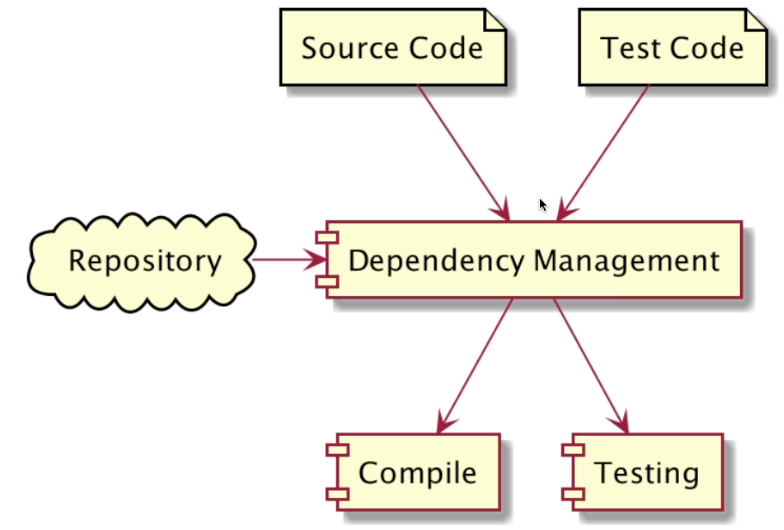

### Pengenalan Build Automation
- Build Automation adalah proses meng-otomisasi tahapan pembuatan software dan hal-hal yang berhubungan dengannya, seperti: kompilasi source code menjadi binary code, mem-package binary code menjadi distribution file, membuat dokumentasi, menjalankan automated test sampai manajemen dependency

### Kompilasi Source Code
```
Source Code -> Compile => Binary file
```

### Mem-Package Binary File
```
Binary File -> Packaging => Distribution File
```

 ### Membuat Dokumentasi
 ```
 Source Code -> Compile Doc => Docuemntation
 ```

 ### Menjalankan Automated Test
 ```
 + Source Code
 | + Test Code
 |/
 + Testing 
 |
 + Test Result
 ```

### Management Dependency


### Contoh Build Automation Tool
- Apache Maven
- Apache Ivy
- Gradle

### Pengenalan Apache Maven
- Apache Maven adalah salah satu build automation yang free dan open source
- Apache menggunakan XML untuk mendefinisikan build script nya
- Apache Maven saat ini sangat populer di kalangan Developer Java
- Apache Maven menggunakan JVM sebagai fondasi dasar
- https://maven.apache.org/

### Teknologi yang Didukung
Apache Maven mendukung build automation untuk banyak teknologi, speerti :
- Java
- Kotlin
- Groovy
- Scala
- dan lain lain