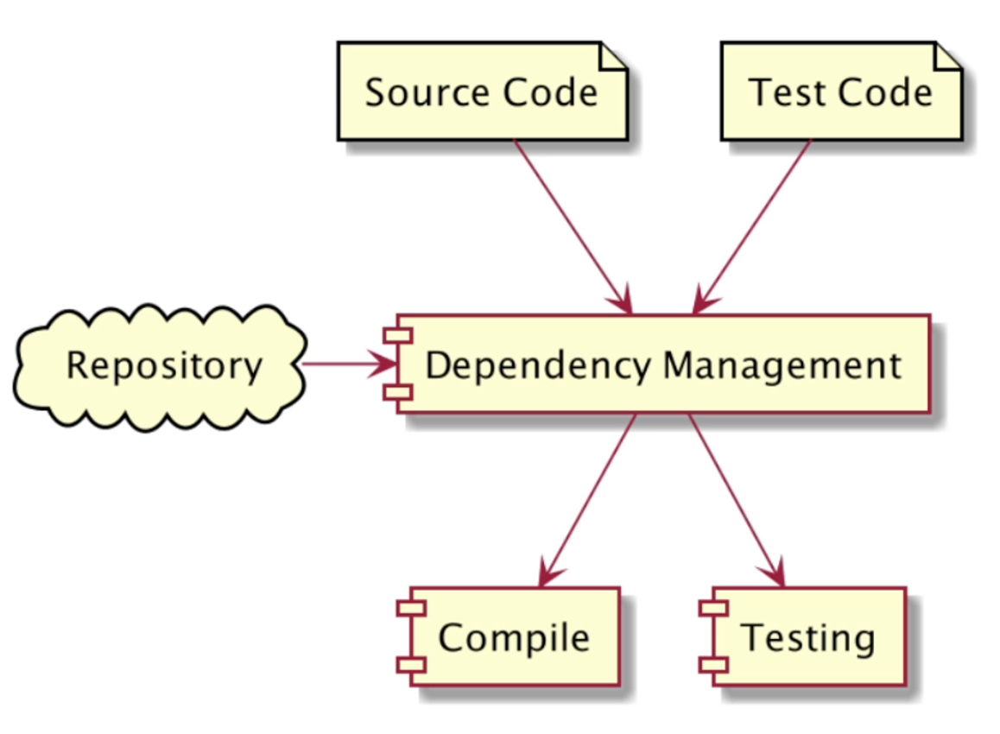

### Dependency
- Proyek aplikasi jarang sekali berdiri sendiri. biasanya membutuhkan dukungan dari pihak lain, seperti tool atau library
- Tanpa build tool seperti Apache Maven, untuk menambahkan library dari luar, kita harus melakukannya secara manual
- Apache Maven mendukung dependency management, dimana kita tidak perlu me-manage secara manual proses penambahkan dependency (tool atau library) ke dalam proyek aplikasi kita

### Dependency Scope
Saat kita menambahkan dependency ke project Maven, kita harus menentukan scope dependency tersebut, ada banyak scope yang ada di MAven, namun sebenarnya hanya beberapa saja yang sering kita gunakan, seperti
- compile, ini adalah scope default. Compile artinya dependency tersebut akan digunakan untuk build project, test project, dan menjalankan project.
- test, ini adalah scope untuk test project, hanya akan di include di bagian test project, hanya akan di include di bagian test project

### Kode : Menambah Dependency
kode ini bisa ditambahkan di pom.xml
```xml
<dependencies>
    <dependency>
        <groupId>junit</groupId>
        <artifactId>junit</artifactId>
        <version>4.11</version>
        <scope>test</scope>
    </dependency>
</dependencies>
```

### Mencari Dependency
- https://search.maven.org/
- https://mvnrepository.com/

### Repository
 

### Kode : Menambah Repository
kode ini bisa ditambahkan di pom.xml
```xml
    <repositories>
        <repository>
            <id>bintray-bliblidotcom-maven</id>
            <name>bintray</name>
            <url>https://dl.bintray.com/bliblidotcom/maven</url>
        </repository>
    </repositories>
</project>
```